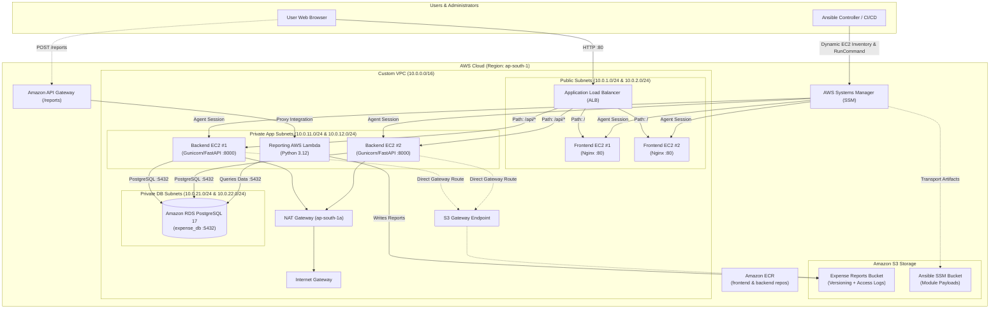
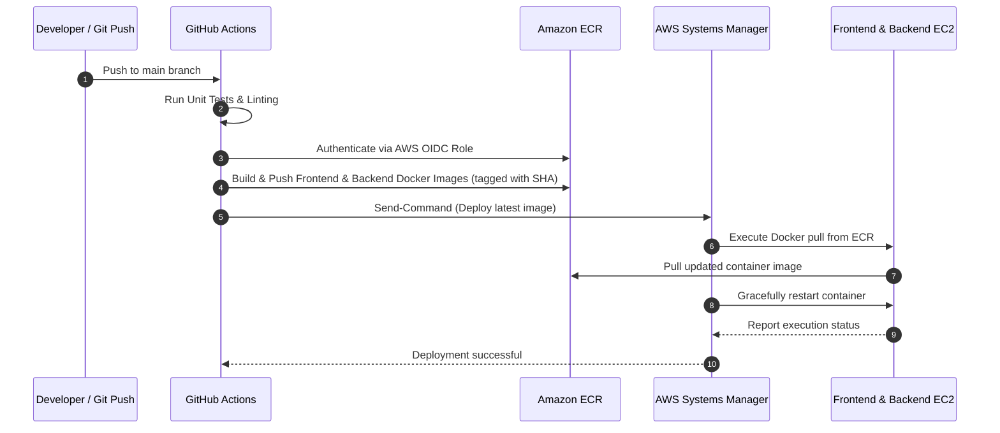

# Cloud Expense Tracker

[](https://aws.amazon.com/)
[](https://www.terraform.io/)
[](https://www.ansible.com/)
[](https://www.docker.com/)
[](https://www.python.org/)
[](https://www.postgresql.org/)

A hands-on, secure, multi-tier cloud and DevOps project demonstrating Infrastructure as Code (IaC), zero-SSH configuration management via AWS Systems Manager (SSM), containerized application workloads, and cloud architecture on AWS.

---

## Table of Contents

- [Project Overview](#project-overview)
- [Architecture](#architecture)
  - [Architecture Overview](#architecture-overview)
  - [Architecture Diagram](#architecture-diagram)
  - [Core Components Breakdown](#core-components-breakdown)
- [Repository Structure](#repository-structure)
- [Local Development](#local-development)
  - [Prerequisites](#prerequisites)
  - [Running with Docker Compose](#running-with-docker-compose)
  - [API Endpoints](#api-endpoints)
- [Infrastructure (Terraform)](#infrastructure-terraform)
  - [Terraform Structure](#terraform-structure)
  - [Variables Configuration](#variables-configuration)
  - [Deployment Steps](#deployment-steps)
- [Configuration Management (Ansible)](#configuration-management-ansible)
  - [Dynamic EC2 Inventory via SSM](#dynamic-ec2-inventory-via-ssm)
  - [Docker Provisioning Playbook](#docker-provisioning-playbook)
- [Containerization](#containerization)
- [CI/CD Pipeline](#cicd-pipeline)
  - [Planned Deployment Flow](#planned-deployment-flow)
  - [Implementation Status](#implementation-status)
- [Security Posture](#security-posture)
- [AWS Resources Summary](#aws-resources-summary)
- [Future Improvements](#future-improvements)

---

## Project Overview

The **Cloud Expense Tracker** is a full-stack expense recording and reporting platform. Users can log daily financial expenditures categorized by type, record notes, filter expenses by month, calculate spending aggregates, and trigger serverless summary report generations.

The system is engineered following enterprise DevOps and cloud architecture principles:
- **Declarative Infrastructure**: AWS infrastructure is provisioned declaratively through Terraform.
- **SSH-Free Server Management**: No bastion hosts, public SSH keys, or port 22 access; all remote orchestration occurs over AWS Systems Manager (SSM).
- **Multi-AZ High Availability**: Workloads are deployed across two availability zones (`ap-south-1a` and `ap-south-1b`) behind an Application Load Balancer.
- **Defense in Depth**: Clear tier separation with public subnets (ALB & frontend), private application subnets (backend EC2 & Lambda), and private database subnets (RDS PostgreSQL).

---

## Architecture

### Architecture Overview

1. **Traffic Ingress**: Users connect over HTTP (port 80) to an external Application Load Balancer (ALB) across two public subnets.
2. **Routing Rules**:
   - Requests matching `/` route to the frontend target group (2 frontend EC2 instances running Nginx containers).
   - Requests matching `/api/*` route to the backend target group (2 backend EC2 instances running Gunicorn/FastAPI containers on port 8000).
3. **Database Tier**: Backend EC2 instances connect to an isolated, private Amazon RDS PostgreSQL 17 instance in dedicated database subnets.
4. **Serverless Reporting**:
   - An Amazon API Gateway HTTP API exposes `/reports`.
   - Incoming requests trigger an AWS Lambda function inside the VPC that accesses RDS and stores generated reports in a private, versioned Amazon S3 bucket.
5. **Orchestration & Registry**:
   - Container images are stored in Amazon Elastic Container Registry (ECR).
   - EC2 instances are configured with Docker using Ansible playbooks executing over AWS SSM with S3-backed payload transport.

### Architecture Diagram



### Core Components Breakdown

| Layer | Technology | Role & Configuration |
| :--- | :--- | :--- |
| **Networking** | AWS VPC | Custom `10.0.0.0/16` CIDR with 6 subnets across 2 AZs (`ap-south-1a`, `ap-south-1b`), IGW, NAT Gateway, and S3 Gateway Endpoint. |
| **Load Balancing** | AWS ALB | Public Application Load Balancer with path-based routing (`/` to frontend on port 80; `/api/*` to backend on port 8000). |
| **Frontend Compute** | Amazon EC2 (AL2023) | 2x `t3.micro` instances in public subnets serving the static single-page application via Docker/Nginx. |
| **Backend Compute** | Amazon EC2 (AL2023) | 2x `t3.micro` instances in private subnets executing the REST API via Docker/Gunicorn/FastAPI. |
| **Database** | Amazon RDS PostgreSQL | Managed PostgreSQL 17 in dedicated private DB subnets with encrypted storage and no public access. |
| **Serverless** | API Gateway & Lambda | HTTP API route `POST /reports` invoking a VPC-connected Python 3.12 Lambda function to generate expense reports. |
| **Storage** | Amazon S3 | Dedicated buckets for application reports (versioned, access-logged), access logs, and Ansible SSM payload caching. |
| **Container Registry**| Amazon ECR | Separate repositories for `expense-tracker-frontend` and `expense-tracker-backend` with scan-on-push enabled. |
| **Management** | AWS SSM & Ansible | Agent-based remote orchestration eliminating SSH key exposure and open inbound administration ports. |

---

## Repository Structure

```text
cloud-expense-tracker/
├── .gitignore                    # Comprehensive ignore rules (Terraform, Python, Ansible, secrets)
├── README.md                     # Project architecture, setup, and operational documentation
├── docker-compose.yml            # Local development orchestration (DB, API, Web)
├── ansible/                      # Ansible configuration and automation playbooks
│   ├── ansible.cfg               # Inventory path and default connection behavior
│   ├── inventory/
│   │   └── aws_ec2.yml           # Dynamic AWS EC2 SSM inventory plugin config
│   └── playbooks/
│       ├── ping.yml              # Connectivity verification playbook over AWS SSM
│       └── docker.yml            # Docker installation and service enablement playbook
├── backend/                      # Python FastAPI REST API
│   ├── Dockerfile                # Python 3.12-slim production container
│   ├── requirements.txt          # Python dependencies (FastAPI, Gunicorn, psycopg)
│   ├── .dockerignore             # Docker build exclusion rules
│   ├── .env.example              # Sample environment variables for local testing
│   └── app/
│       ├── __init__.py           # Application package initializer
│       ├── config.py             # Environment configuration & DATABASE_URL parsing
│       ├── db.py                 # PostgreSQL connection pool & schema migration
│       ├── main.py               # WSGI application factory
│       └── routes.py             # API endpoints (/health, /expenses)
├── frontend/                     # Nginx static web frontend
│   ├── Dockerfile                # Nginx Alpine container definition
│   ├── index.html                # Single-page expense tracker application UI
│   ├── style.css                 # Application styling
│   └── app.js                    # Client-side JavaScript (Fetch API integration)
└── terraform/                    # Terraform Infrastructure as Code (IaC)
    ├── provider.tf               # AWS provider configuration
    ├── variables.tf              # Input variable definitions (region, db_username, etc.)
    ├── terraform.tfvars.example  # Example values template for sensitive variables
    ├── vpc.tf                    # VPC, subnets, route tables, IGW, NAT, S3 endpoint
    ├── alb.tf                    # Application Load Balancer, listeners, target groups
    ├── ec2.tf                    # Security groups, EC2 instances, SSM instance profiles
    ├── rds.tf                    # RDS PostgreSQL 17 instance & DB subnet group
    ├── s3.tf                     # S3 buckets (reports, logs, Ansible SSM transport)
    ├── iam.tf                    # IAM roles & policies for SSM, EC2, and Ansible controller
    ├── ecr.tf                    # ECR repositories with image scanning
    ├── lambda.tf                 # Lambda reporting function, VPC config, IAM execution role
    ├── lambda_function.py        # Lambda handler script
    ├── api_gateway.tf            # API Gateway HTTP API and Lambda integration
    └── outputs.tf                # Exported resource identifiers and connection endpoints
```

---

## Local Development

### Prerequisites

- [Docker](https://docs.docker.com/get-docker/) & [Docker Compose](https://docs.docker.com/compose/)
- [Git](https://git-scm.com/)
- Optional: Python 3.12+ (if developing outside Docker)

### Running with Docker Compose

1. Clone or navigate to the repository directory:
   ```bash
   cd cloud-expense-tracker
   ```

2. Start the local multi-container stack:
   ```bash
   docker compose up --build
   ```

   This launches three coordinated containers:
   - `expense-postgres`: PostgreSQL 17 database on port `5432`.
   - `expense-backend`: Gunicorn/FastAPI API server on port `8000`.
   - `expense-frontend`: Nginx serving the static application on port `3000`.

3. Access the application:
   - **Frontend UI**: Open [http://localhost:3000](http://localhost:3000) in your browser.
   - **API Health Check**: [http://localhost:8000/api/health](http://localhost:8000/api/health)
   - **API Expenses**: [http://localhost:8000/api/expenses](http://localhost:8000/api/expenses)

4. Stop the local environment:
   ```bash
   docker compose down
   ```
   To remove persistent database volumes as well:
   ```bash
   docker compose down -v
   ```

### API Endpoints

| Method | Endpoint | Description | Sample Request / Response |
| :--- | :--- | :--- | :--- |
| `GET` | `/api/health` | Service and database health check | `{"status": "ok", "database": "connected"}` |
| `GET` | `/api/expenses` | Retrieve all recorded expenses | `[{"id": 1, "amount": "450.00", "category": "Food", ...}]` |
| `POST` | `/api/expenses` | Record a new expense | `{"amount": 500, "category": "Travel", "description": "Taxi", "expense_date": "2026-09-23"}` |
| `DELETE` | `/api/expenses/<id>` | Delete an expense by ID | `{"deleted": 1}` |

---

## Infrastructure (Terraform)

Terraform manages the complete lifecycle of the cloud infrastructure in the `ap-south-1` region.

### Terraform Structure

The infrastructure code is modularized by resource type:
- `vpc.tf`: Multi-tier network architecture with public, application private, and database private subnets.
- `alb.tf`: Public Application Load Balancer with HTTP health checks and path routing.
- `ec2.tf`: Frontend and backend EC2 instances configured with IAM SSM profiles and restrictive security groups.
- `rds.tf`: Isolated Amazon RDS PostgreSQL instance with storage encryption.
- `iam.tf`: Least-privilege IAM policies for SSM agent, S3 bucket access, and Ansible controller credentials.
- `s3.tf`: Versioned S3 buckets with encryption and public access blocks.
- `lambda.tf` & `api_gateway.tf`: Serverless expense report generation pipeline.
- `ecr.tf`: Private container registries with vulnerability scanning.

### Variables Configuration

1. Create a `terraform.tfvars` file based on `terraform.tfvars.example`:
   ```bash
   cd terraform
   cp terraform.tfvars.example terraform.tfvars
   ```

2. Edit `terraform.tfvars` with your secure credentials:
   ```hcl
   region         = "ap-south-1"
   project_suffix = "yd2026"
   db_username    = "expense_user"
   db_password    = "UseAStrongSecretPasswordHere!"
   ```
   > **Important**: `terraform.tfvars` is ignored by Git and must **never** be committed.

### Deployment Steps

```bash
cd terraform

# Initialize provider plugins
terraform init

# Validate configuration syntax
terraform validate

# Review proposed changes
terraform plan -out=tfplan

# Apply the infrastructure plan
terraform apply tfplan
```

To display resource outputs after deployment:
```bash
terraform output
```

---

## Configuration Management (Ansible)

Ansible configures the provisioned EC2 instances **without SSH**. It connects natively through the AWS Systems Manager (SSM) Session Manager plugin.

### Dynamic EC2 Inventory via SSM

The inventory configuration (`ansible/inventory/aws_ec2.yml`) dynamically discovers EC2 instances based on tags:
- Automatically targets instances matching `expense-tracker-frontend-*` and `expense-tracker-backend-*`.
- Groups instances into `frontend` and `backend` inventories.
- Uses `ansible_connection: 'aws_ssm'` and stages large file transfers through the dedicated S3 bucket (`expense-tracker-ansible-ssm-yd2026`).

### Testing SSM Connectivity

Verify that all EC2 instances are registered with SSM and reachable:

```bash
cd ansible
ansible-playbook playbooks/ping.yml
```

### Docker Provisioning Playbook

The `playbooks/docker.yml` playbook automates the host configuration on Amazon Linux 2023:
1. Installs the Docker package using `ansible.builtin.dnf`.
2. Enables and starts the `docker` systemd service.
3. Validates the Docker version and active service state.

Execute the playbook:
```bash
ansible-playbook playbooks/docker.yml
```

> **macOS Note**: When running Ansible with AWS SSM on macOS, you may need to disable Python fork safety in your environment:
> ```bash
> export OBJC_DISABLE_INITIALIZE_FORK_SAFETY=YES
> ```

---

## Containerization

The application is fully containerized with minimal, security-hardened images:

### Frontend Container (`frontend/Dockerfile`)
- **Base Image**: `nginx:alpine`
- **Port**: `80`
- **Function**: Serves static HTML, CSS, and client-side JavaScript. In production, Nginx proxies requests or relies on the ALB to route `/api/*` traffic directly to the backend.

### Backend Container (`backend/Dockerfile`)
- **Base Image**: `python:3.12-slim`
- **Port**: `8000`
- **Application Server**: Gunicorn/FastAPI server running `app.main:app`
- **Database Driver**: `psycopg` (version 3) connecting to PostgreSQL.

---

## CI/CD Pipeline

### Planned Deployment Flow

The target CI/CD architecture leverages GitHub Actions to achieve continuous delivery without exposing private network interfaces:



### Implementation Status

- [x] **Container definitions**: Dockerfiles created for frontend and backend.
- [x] **Infrastructure**: ECR repositories, IAM roles, and VPC endpoints provisioned via Terraform.
- [x] **Host runtime**: Docker installed and verified on EC2 instances via Ansible.
- [ ] **GitHub Actions Workflow** *(Planned - Not Yet Implemented)*: `.github/workflows/deploy.yml` with AWS OIDC authentication.
- [ ] **Automated Container Run** *(Planned - Not Yet Implemented)*: SSM Run Command automation script to launch frontend and backend containers from ECR.

---

## Security Posture

Security is designed into every layer of this repository:

1. **Zero SSH Access**:
   - Port 22 is completely closed in all Security Groups.
   - EC2 instances do not have SSH key pairs assigned.
   - All management happens over encrypted SSM channels authenticated through AWS IAM.
2. **Network Isolation (Tiering)**:
   - **Public Subnet**: ALB and Frontend EC2.
   - **Private App Subnet**: Backend EC2 and Lambda function. Backend instances have no public IPs; outbound internet traffic for package updates is routed through a NAT Gateway.
   - **Private DB Subnet**: Amazon RDS instance has no internet route, no public IP (`publicly_accessible = false`), and only accepts incoming connections from Backend EC2 (`app_sg`) and Lambda (`lambda_sg`) on port 5432.
3. **Application Load Balancer Security Groups**:
   - Backend EC2 only accepts traffic from the ALB security group on port 8000.
   - Direct external access to the backend API is blocked.
4. **Secrets Management**:
   - Database credentials are fed through Terraform variables marked `sensitive = true`.
   - `.gitignore` strictly blocks `*.tfvars`, `*.tfstate*`, `.env`, and secret archives from being tracked.
   - A `terraform.tfvars.example` is provided for safe configuration.
5. **Terraform State Protection**:
   - Terraform state contains plaintext credentials and resource metadata. Local state files are ignored by Git.
   - For team production environments, migrate local state to a remote backend (Amazon S3 with server-side encryption and DynamoDB state locking).

---

## AWS Resources Summary

The following major AWS resources are provisioned in the `ap-south-1` region:

| Resource Category | AWS Service | Resource Name / Identifier | Purpose |
| :--- | :--- | :--- | :--- |
| **Networking** | VPC | `expense-tracker-vpc` | Isolated network (`10.0.0.0/16`) |
| **Networking** | Subnets | `expense-tracker-public-*`, `private-*` | 2 public, 2 private app, 2 private DB subnets |
| **Networking** | NAT Gateway | `expense-tracker-nat-gateway` | Outbound internet for private backend instances |
| **Networking** | VPC Endpoint | `expense-s3-endpoint` | Private S3 gateway endpoint for VPC traffic |
| **Traffic** | ALB | `expense-alb` | Public load balancer routing `/` and `/api/*` |
| **Compute** | EC2 | `expense-tracker-frontend-1`, `frontend-2` | Hosts frontend Nginx containers |
| **Compute** | EC2 | `expense-tracker-backend-1`, `backend-2` | Hosts backend Gunicorn/FastAPI containers |
| **Database** | RDS | `expense-tracker-db` | Private PostgreSQL 17 database instance |
| **Container Registry**| ECR | `expense-tracker-frontend`, `backend` | Private Docker image repositories |
| **Serverless** | Lambda | `expense-tracker-lambda` | Python 3.12 asynchronous report generator |
| **Serverless** | API Gateway | `expense-tracker-api` | HTTP API entry point for `/reports` |
| **Storage** | S3 | `expense-tracker-bucket-*` | Application reports and artifacts |
| **Storage** | S3 | `expense-tracker-logs-*` | Server access logs storage |
| **Storage** | S3 | `expense-tracker-ansible-ssm-*` | Payload transport bucket for Ansible SSM |
| **IAM** | Roles & Policies | `expense-ec2-ssm-role`, `expense-lambda-role` | Least-privilege IAM roles for compute and services |

---

## Future Improvements

The following enhancements are planned for future iterations:

- **Auto Scaling Groups (ASG)**: Replace static EC2 instances with Auto Scaling Groups across both availability zones for dynamic scale-up/scale-down and self-healing replacement.
- **HTTPS & Custom Domain**: Configure AWS Certificate Manager (ACM) SSL/TLS certificate on the ALB listener (port 443) and route DNS via Amazon Route 53.
- **Terraform Remote Backend**: Migrate state storage from local files to an S3 bucket with server-side KMS encryption and DynamoDB state locking.
- **Asynchronous Report Queuing (SQS)**: Add an Amazon SQS queue between the backend API and Lambda for resilient, asynchronous report processing under high load.
- **AWS Secrets Manager**: Integrate AWS Secrets Manager or SSM Parameter Store for dynamic database credential rotation.
- **Monitoring & Observability**: Implement Amazon CloudWatch Dashboards, Container Insights, and CloudWatch Alarms for CPU, memory, and database connection metrics.

---

## License

This project is licensed under the MIT License. See [LICENSE](LICENSE) for details.
